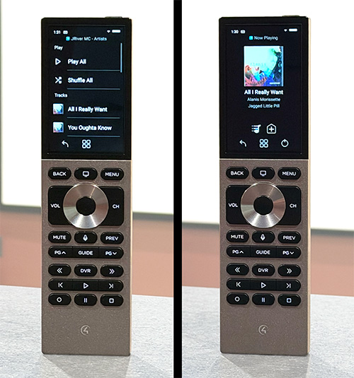

# JRiver Media Center — Control4 Integration

A single self-contained Control4 driver for JRiver Media Center. Browse and control your
music from a Halo Touch or other navigator, or drive Media Center's own Theater View from the
room remote when it's on a display.

> **Status: working, in use.** Installed and exercised on Control4 OS 3 with a Halo Touch
> remote against Media Center 35 on macOS: browsing, playback, remote transport keys, queue
> jumping, Theater View control, room selection and artwork all confirmed on hardware. See
> *Known limitations* below.



*Left: an artist's tracks, with Play All and Shuffle All. Right: Now Playing with album artwork.*

## Design

Everything — architecture, MCWS integration, proxy choice, the defect list the rewrite
resolves, and the phase plan — lives in **[DESIGN.md](DESIGN.md)**.

Build instructions are in **[README_BUILD.md](README_BUILD.md)**.

## How it works

```
┌──────────────┐   proxy 5001 (media_service)   ┌─────────────────┐
│ Halo Touch   │ ◄────── browse / transport ───►│                 │
│ & navigators │                                │  JRiver driver  │       ┌──────────────┐
└──────────────┘   proxy 5002 (media_player)    │   (single .c4z) │◄─────►│ Media Center │
┌──────────────┐ ◄──── nav keys / transport ───►│                 │ MCWS  │  (MCWS API)  │
│ Room remote  │                                └────────┬────────┘  HTTP └──────┬───────┘
└──────────────┘                                         │                       │
                                              HDMI / audio out          HDMI → AVR → projector
```

Two modes, one driver:

- **Listen** — projector off. Browse the library and control playback entirely from the
  navigator, via the `media_service` proxy.
- **Watch** — projector on with Media Center in Theater View. Directions, select and back
  from the room remote drive Media Center's own on-screen UI, via the `media_player` proxy.

The driver polls `UserInterface/Info` to know which mode Media Center is actually in, and
switches views to follow the room: selecting the Watch source puts Media Center into Theater
View, and selecting Listen or turning the room off returns it to the standard view. Each is
switchable, and all are event-driven — the driver will not fight you if you change Media
Center's view by hand.

## Requirements

- JRiver Media Center with Media Network enabled (MCWS, default port 52199)
- Control4 OS 3.0.0+ and Composer Pro
- Network reachability to the Media Center host from the Control4 controller **and from every
  navigator that will show artwork** — touchscreens, apps, and the Halo remote each fetch
  album art directly from Media Center, not via the controller. On a segmented network this
  means a firewall rule per navigator, not just one for the controller.

## Installation

Download **`jriver_media_center.c4z`** from the [latest release](../../releases/latest).

> Keep the filename as it is. Composer derives the driver's asset namespace from it, so a
> renamed package loses every bundled icon.

In Composer Pro:

1. **Drivers → Add Driver → Add from file**, and pick the `.c4z`.
2. Add it to your project. Three entries appear: the music service, the Theater View device,
   and a virtual switcher that is hidden from Navigator.
3. Set **JRiver Host** and **JRiver Port** (default 52199), and **Zone** if you use more than
   one.
4. Connect **JRiver Virtual Switcher → HDMI OUTPUT** to the AVR input the Media Center
   machine is plugged into. That single binding serves both Listen and Watch; the links
   between the driver's own proxies bind themselves.
5. Run the **Test Connection** action to confirm the driver can reach Media Center. It logs
   the version and the available zones.

Upgrading is Composer's normal driver update. Note that changing the package *filename*
changes the driver's identity, so a differently named build has to be removed and re-added
rather than updated in place.

### Building from source

```bash
./build.sh          # → build/jriver_media_center.c4z
lua test-driver.lua # offline regression test, no controller needed
```

See [README_BUILD.md](README_BUILD.md) for prerequisites and the packaging rules worth
knowing before changing anything.

## Configuration

| Property | Default | Description |
|---|---|---|
| JRiver Host | (empty) | Media Center IP or hostname |
| JRiver Port | 52199 | MCWS port |
| Zone | -1 | `-1` follows Media Center's currently selected zone |
| Poll Interval | 2 | Seconds between state updates |
| Cache TTL | 300 | Browse tree cache lifetime, seconds |
| Take Focus on Key | Off | Raise Media Center when sending navigation keys |
| Enter Theater View on Select | On | Switch MC to Theater View when the room selects it |
| Leave Theater View on Deselect | On | Return MC to the standard view when deselected |
| Leave Theater View on Listen | On | Return MC to the standard view when the music service is selected |
| Handle Volume | Off | Leave volume to the AVR unless enabled |
| Username / Password | (empty) | Only if Media Center authentication is enabled |
| UI Mode | (read-only) | Media Center's current UI mode, e.g. Standard or Theater |
| Debug Mode | Off | Verbose logging |

## Automation

The driver exposes a full programming surface, so Media Center can be driven from — and can
drive — Control4 programming without anyone opening a Navigator.

**Variables** (all read-only): `Connected`, `Playback State`, `Playing`, `Track`, `Artist`,
`Album`, `Position`, `Duration`, `Shuffle`, `Repeat`, `Theater View`, `UI Mode`,
`Queue Position`, `Queue Count`. They are written only on change, so they can safely drive
conditionals without re-triggering on every poll.

**Events:** Track Changed, Playback Started / Paused / Stopped, Theater View Entered /
Exited, Connection Lost / Restored.

Events come from the driver's poll loop, not from a proxy, so they fire in Listen mode, in
Watch mode, and with nothing selected in any room. Composer lists them under one device entry;
that grouping is cosmetic. Polling runs at the configured interval whenever something is
playing or selected, and drops to 30 seconds only when both are idle.

**Commands:**

Composer files a driver's programming under one of its device entries — for this driver, the
Theater View one. That is only where Composer lists them: driver commands are **not**
proxy-scoped and work in either mode, or with nothing selected at all. The transport each
proxy exposes separately is the part that depends on the room's current selection.

| Command | Notes |
|---|---|
| JRiver Play / Pause / Stop / Next Track / Previous Track | Act on Media Center directly, regardless of what the room has selected. Prefixed to distinguish them from the proxies' own transport. |
| Play Path / Shuffle Path | Addresses a browse node by name, e.g. `Audio\Artist\Example Artist`. Backslashes or forward slashes. |
| Play Playlist | By playlist name, with an optional shuffle |
| Set Shuffle / Set Repeat / Seek | |
| Enter Theater View | Toggle, Home, Playing Now or Audio |
| Leave Theater View | |
| Send Key | A `Control/Key` sequence, e.g. `Down;Down;Enter` |
| Send MCC | Any Media Core Command, for anything not surfaced above |

Paths and playlists are addressed **by name**, not by the numeric IDs Media Center assigns,
because those are reassigned and are not what a person writing programming knows.

Some things this makes easy: a Wake-Up scene that starts a playlist shuffled; a Good Night
button that stops playback and leaves Theater View; motion-triggered pause; a keypad LED
tracking `Playing`; announcing the current `Track`; or reacting to `Connection Lost` if the
Media Center machine goes down.

## Known limitations

- **No progress bar on Halo Touch.** The driver broadcasts `ProgressChanged` with position,
  duration and a label, and this matches what shipping drivers send, but Halo Touch does not
  appear to render a progress bar for media services. Elapsed and total time are still shown
  on the queue rows. Other Navigator types are untested.
- **Authentication is untested.** Media Center's Media Network authentication is off on the
  system this was developed against. The Basic-auth and token flow is implemented against the
  documented `Authenticate` endpoint and verified as far as the token round-trip, but has not
  run against a server that actually requires it.

## Troubleshooting

**Driver can't reach Media Center** — confirm Media Network is enabled and test directly:
`curl http://<mc-host>:52199/MCWS/v1/Alive`.

**Empty browse lists** — check the Host property, then walk the tree by hand:
`curl "http://<mc-host>:52199/MCWS/v1/Browse/Children?ID=-1&ErrorOnMissing=0"`. What the
driver shows is what Media Center's Browse Rules define; adjust them in MC itself.

**Artwork missing on one navigator but fine on another** — each navigator fetches album art
directly from Media Center over HTTP. If the controller is on a different VLAN from Media
Center and has an allow rule, the remotes and touchscreens need their own rules too; a Halo
with no route to Media Center shows placeholder icons while everything else works. Test the
exact URL the driver emits from the navigator's network:
`curl "http://<mc-host>:52199/MCWS/v1/File/GetImage?File=<key>&Width=140&Height=140"`.

The driver deliberately does not proxy artwork through the controller — see `DESIGN.md`.

**Navigation doesn't move the Theater View cursor** — note that `Control/Key` returns
`Status="OK"` whether or not it did anything, so the response proves nothing. Verify by
watching the screen. If keys are ignored, try turning **Take Focus on Key** On, which raises
Media Center before sending.

**A remote key does nothing** — turn on Debug Mode and press it. The driver logs every
unrecognised proxy command once, naming it, so an unmapped key is visible in the log rather
than silently dropped.

## Prior art

Control4 integrations for JRiver have been attempted before — a commercial driver and a
couple of community efforts, all dating from 2012–2013, and a forum thread in 2017 still
asking for one. The commercial vendor's site no longer resolves, and there is nothing
currently listed in the Control4 driver database, on the third-party driver marketplaces, or
open source. Those attempts also predate most of the API this driver is built on, including
the `Browse/*` tree and the OS 3.2.1 Navigator capabilities.

## License

MIT License — see [LICENSE](LICENSE).

Third-party components, with their own terms:

- **[Feather](https://feathericons.com/)** icons by Cole Bemis (MIT) — the tab and Now Playing
  glyphs. The vendored subset and its licence are in [`vendor/feather/`](vendor/feather/).
- **[JSON.lua](https://regex.info/blog/lua/json)** by Jeffrey Friedl (CC BY 3.0) —
  `module/json.lua`, bundled into the driver package. Its copyright notice, links and author
  note are retained in the file as that licence requires.

The device and branding marks are original work.

## Acknowledgments

- [JRiver Media Center](https://jriver.com/) for MCWS and for serving its own API reference
  at `/MCWS/v1/doc`
- [Control4/Snap One](https://snapone.com/) for the DriverWorks framework and the
  [MSP examples](https://github.com/snap-one/docs-driverworks)
